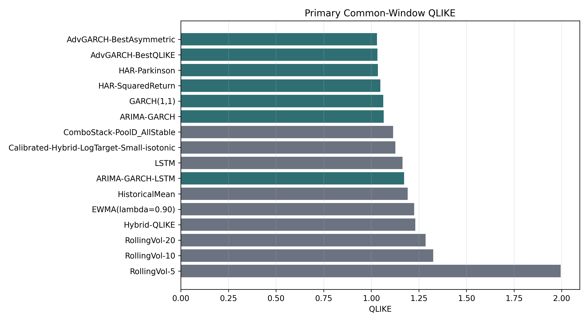
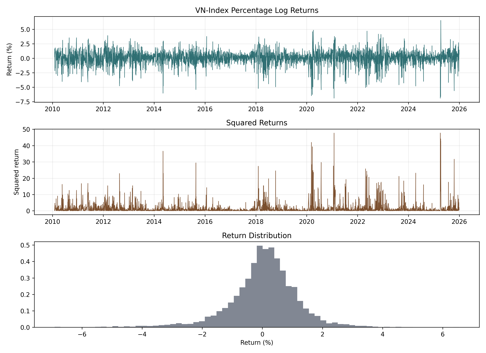
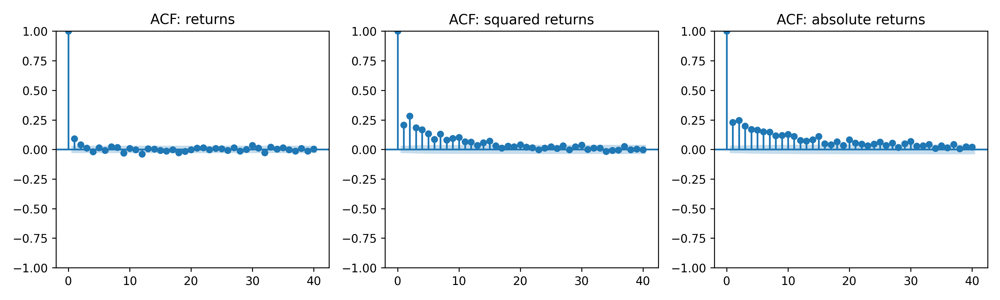
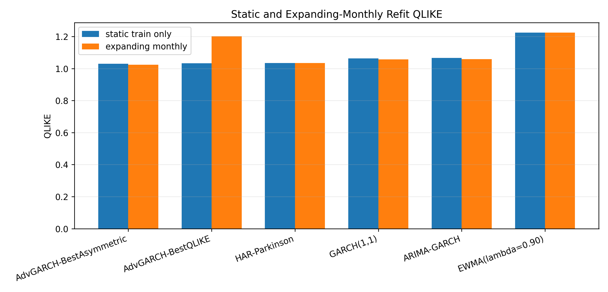
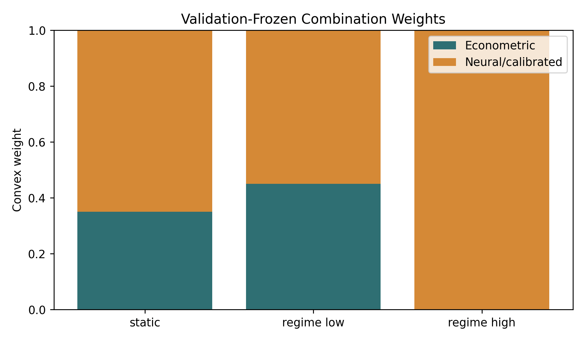
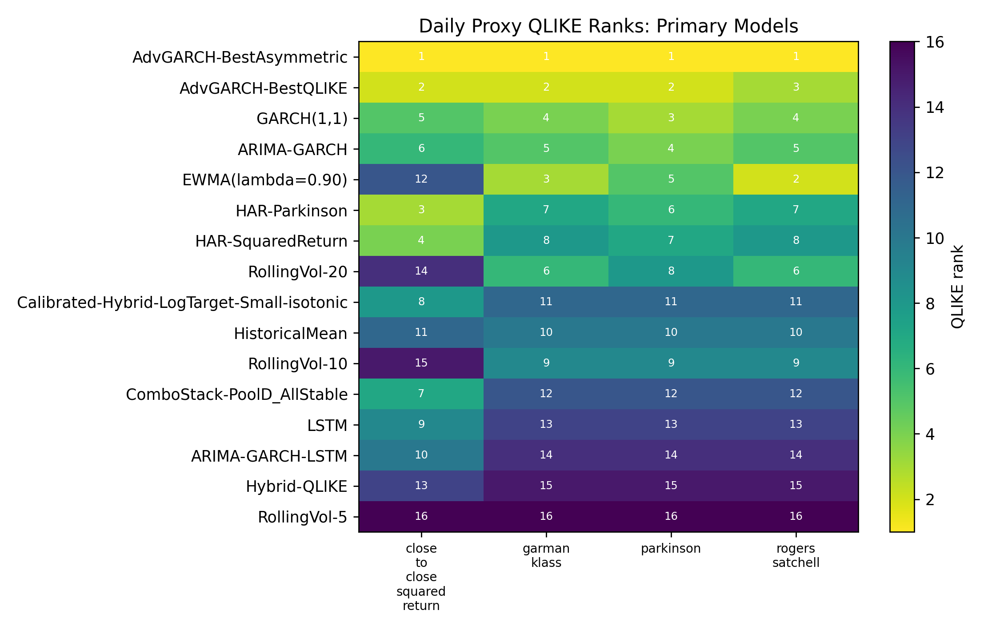

# Modeling and Forecasting VN-Index Volatility
### A Financial Econometric Evaluation of GARCH-Family, HAR, Neural, and Hybrid Approaches

This repository contains a Time Series / Financial Econometrics course project on one-day-ahead VN-Index volatility forecasting using daily CafeF OHLC and trading-activity data. The study compares classical financial econometric models with neural and hybrid alternatives, then evaluates them through volatility-specific loss, proxy robustness, operational refit stability, spike-period behavior, and standardized risk diagnostics.

📄 **Paper:** [paper.pdf](./paper.pdf)

## Why This Study?

Volatility forecasts are inputs to market-risk monitoring, portfolio control, and Value-at-Risk style stress assessment. The VN-Index provides an economically relevant Vietnamese equity-index setting where daily data are practical, but high-frequency realized-volatility targets are not always available. This makes daily close, range, volume, and value information important.

The central empirical issue is not only whether a model has low average forecast error. A useful volatility model should also behave sensibly during volatility spikes, remain stable under periodic refitting, and avoid giving misleading comfort in strict tail-risk diagnostics.

## Research Question

> Can daily VN-Index volatility be forecast reliably using standard financial econometric models, and do neural or hybrid alternatives provide robust gains once proxy uncertainty, model-selection discipline and tail-risk diagnostics are considered?

## Contributions

1. A leakage-safe out-of-sample comparison of daily VN-Index volatility forecasts on a corrected `745`-observation common test window.
2. Financial-econometric evidence on heavy tails, volatility clustering, ARCH effects, persistence and asymmetric volatility response.
3. A systematic comparison of EWMA, HAR, GARCH-family, corrected-context neural and hybrid forecasting approaches.
4. Robustness analysis using OHLC-based volatility proxies and expanding-window monthly refits.
5. Risk-aware interpretation through standardized VaR diagnostics and spike-day evaluation.
6. A controlled, validation-frozen regime-aware combination experiment testing whether neural information helps in high-volatility regimes.

## Data and Forecasting Setup

The empirical sample uses daily CafeF VN-Index observations from 2010 through 2025. The cleaned data include open, high, low, close, matched trading volume, and matched trading value. Forecasts are built chronologically: training observations end in 2019, validation covers 2020-2022, and the final test period covers 2023-2025.

The primary target is next-day squared percentage log return:

\[
r_t = 100 \log \left(\frac{C_t}{C_{t-1}}\right), \qquad
y_t = r_{t+1}^2.
\]

The authoritative corrected-context out-of-sample window is:

| Item | Value |
| --- | --- |
| Forecast-origin dates | `2023-01-03` to `2025-12-30` |
| Target dates | `2023-01-04` to `2025-12-31` |
| Common test observations | `N = 745` |
| Primary target | Next-day squared percentage log return |

Squared returns are observable and simple, but noisy. A single close-to-close return can miss intraday variation or be dominated by a jump, so the paper also checks robustness against daily OHLC volatility proxies.

## Models Evaluated

| Model family | Included approaches | Purpose |
| --- | --- | --- |
| Simple baselines | Historical mean, rolling volatility | Minimum reference benchmarks |
| Industry benchmark | EWMA / RiskMetrics | Transparent risk-oriented volatility benchmark |
| HAR models | HAR-SquaredReturn, HAR-Parkinson | Multi-horizon volatility persistence and OHLC range information |
| GARCH-family | GARCH, ARIMA-GARCH, EGARCH and selected advanced variants | Conditional variance persistence and asymmetry |
| Neural/hybrid | LSTM, ARIMA-GARCH-LSTM, calibrated neural variants | Nonlinear sequential alternatives |
| Combinations | Static and regime-aware combinations | Test complementary forecast information |

## Main Results

The corrected primary leaderboard uses the same `745` target dates for every listed model. Lower QLIKE is better.

| Rank | Model | QLIKE | Interpretation |
| ---: | --- | ---: | --- |
| 1 | AdvGARCH-BestAsymmetric | 1.029992 | Best average QLIKE; asymmetric comparator |
| 2 | AdvGARCH-BestQLIKE | 1.032548 | Primary validation-selected advanced model |
| 3 | HAR-Parkinson | 1.034521 | Strong OHLC range-based benchmark |
| 4 | HAR-SquaredReturn | 1.047975 | Strong HAR comparator |
| 5 | GARCH(1,1) | 1.062958 | Canonical GARCH benchmark |



Selected GARCH-family specifications and HAR-Parkinson form the strongest average-loss group. Corrected neural and hybrid forecasts do not outperform these models on overall QLIKE. This conclusion survives corrected neural retraining and the expanded `N = 745` common test window.

## Econometric Evidence from VN-Index Returns



| Diagnostic | Verified result | Interpretation |
| --- | ---: | --- |
| Skewness | -0.7814 | Negative-return asymmetry |
| Excess kurtosis | 3.9794 | Heavy-tailed returns |
| Jarque-Bera test | Rejects normality | Normal-tail assumptions require caution |
| ARCH-LM tests | Strong rejection at lags 5, 10, 20 | Conditional variance modeling is warranted |
| GARCH persistence | \(\alpha + \beta = 0.9733\) | Volatility shocks decay slowly |
| Shock half-life | ~25.6 trading days | Persistent market-risk effects |



Daily VN-Index returns are negatively skewed and heavy-tailed, while squared and absolute returns display much stronger dependence than raw returns. Post-fit squared standardized residual diagnostics show that selected GARCH-family models remove much of the observed conditional heteroskedasticity, although tail calibration remains a separate risk question.

## Operational Refit Stability



Periodic expanding-window refitting improves or preserves performance for several stable econometric models. `AdvGARCH-BestAsymmetric` remains strong with full forecast coverage. `AdvGARCH-BestQLIKE` is strong in static evaluation, but its expanding-monthly refit fails in multiple monthly segments and only produces `340` forecasts, making it operationally fragile. In applied risk monitoring, average forecast quality should be considered jointly with estimation stability.

Incomplete-coverage refit metrics are retained as operational evidence, not as directly comparable complete-window rankings.

## Regime-Aware Forecast Combination

The regime-aware combination is an exploratory, validation-frozen extension motivated by regime-performance differences. It uses an origin-observable trailing-volatility regime indicator and freezes the selected experts, threshold, and weights before test evaluation.

| Model | QLIKE | Interpretation |
| --- | ---: | --- |
| Static combination | 1.077023 | Validation-selected fixed-weight combination |
| Regime-aware combination | 1.064346 | Improves on static combination |
| HAR-Parkinson | 1.034521 | Still better on overall QLIKE |
| AdvGARCH-BestAsymmetric | 1.029992 | Best average-loss result |



The regime-aware combination improves on its static counterpart and improves some high-volatility or spike-period diagnostics. It does not replace the strongest econometric models overall. The result is best read as evidence of limited neural complementarity in turbulent periods, not as a claim of neural dominance.

## Risk Diagnostics

The broad risk comparison maps every variance forecast to lower-tail VaR using a common zero-mean Normal return distribution. This standardizes the comparison, but it also means the results should be interpreted as a common risk-mapping diagnostic rather than a full heavy-tailed distribution-specific VaR/ES contribution.

| Model | Risk diagnostic | Result | Interpretation |
| --- | --- | ---: | --- |
| GARCH(1,1) | 1% VaR violations | 16 / 745 | More violations than expected |
| GARCH(1,1) | Kupiec p-value | 0.0063 | Rejects unconditional coverage |
| AdvGARCH-BestAsymmetric | 1% VaR violations | 15 / 745 | Strict-tail undercoverage remains |
| Regime-aware combination | 5% VaR violations | 23 / 745 | Fewer violations than expected under the common Normal mapping |

Good average QLIKE does not automatically imply satisfactory strict-tail calibration. At the strict `1%` level, several strong average-loss econometric models show too many violations relative to the `7.45` expected count. Neural-dependent forecasts can reduce some spike-period variance losses while still displaying imperfect VaR calibration.

## Robustness to Volatility Proxies



Exact rankings vary according to the volatility proxy. GARCH-family models remain consistently competitive across close-to-close, Parkinson, Garman-Klass, and Rogers-Satchell daily proxies. HAR-Parkinson performs strongly on the main squared-return target because OHLC range information is useful. Rolling Yang-Zhang proxies are treated separately as smoothed sensitivity evidence rather than identical one-day target replacements.

## Repository Structure

```text
.
├── paper.pdf                         # Canonical final compiled paper
├── paper/                            # LaTeX manuscript, figures, tables, build rules
├── src/                              # Data preparation, modelling, evaluation, extensions
├── tests/                            # Leakage, metric, proxy, VaR, and artifact tests
├── data/                             # Raw and processed CafeF VN-Index data artifacts
├── outputs/                          # Predictions, diagnostics, final tables, manifests
├── models/                           # Versioned model artifacts and archives
├── reports/                          # Audit and revision records
├── docs/                             # Experiment contract and pipeline notes
├── Makefile                          # Reproduction commands
├── requirements.txt                  # Pinned Python package versions
├── pyproject.toml                    # Project metadata and pytest configuration
└── README_REPRODUCIBILITY.md         # Detailed reproduction notes
```

| Artifact | Purpose |
| --- | --- |
| `paper.pdf` | Final report |
| `outputs/artifact_manifest.csv` | Artifact provenance and hashes |
| `outputs/neural_corrected_context_v2/` | Retrained corrected-context neural outputs |
| `outputs/advanced_corrected_context_v2/` | Corrected neural-dependent calibration and combination outputs |
| `outputs/final/` | Final evaluation outputs |
| `reports/` | Audit and revision records |
| `README_REPRODUCIBILITY.md` | Detailed reproduction instructions |

## Reproducibility and Availability

- **Code repository:** [TSA_ARIMA-GARCH-LSTM](https://github.com/trantuan1701/TSA_ARIMA-GARCH-LSTM.git)
- **Reproduction snapshot:** use the release commit or tag that contains this README, `paper.pdf`, and the final artifact manifest.
- **Final paper:** [paper.pdf](./paper.pdf)
- **Artifact manifest:** [`outputs/artifact_manifest.csv`](./outputs/artifact_manifest.csv)
- **Environment:** see [`requirements.txt`](./requirements.txt) and [`pyproject.toml`](./pyproject.toml)
- **Detailed reproduction guide:** [`README_REPRODUCIBILITY.md`](./README_REPRODUCIBILITY.md)

Raw CafeF data are used for the empirical study. The local course-submission repository contains CafeF data artifacts under `data/raw/` and processed data under `data/processed/`, but no redistribution license was found. Public reuse should verify data rights or reconstruct the expected local data layout from CafeF before rerunning the full pipeline.

## How to Reproduce the Results

### 1. Environment setup

```bash
git clone https://github.com/trantuan1701/TSA_ARIMA-GARCH-LSTM.git
cd TSA_ARIMA-GARCH-LSTM

python -m venv .venv
source .venv/bin/activate
pip install -r requirements.txt
```

### 2. Data preparation

If raw CafeF data need to be rebuilt, place the expected raw extract at:

```text
data/raw/vnindex_cafef_2010_2025_raw.csv
```

Then run:

```bash
PYTHONDONTWRITEBYTECODE=1 make data
```

### 3. Reproduce corrected neural artifacts

```bash
make neural-corrected
make advanced-corrected-combinations
```

### 4. Generate final result artifacts

```bash
PYTHONDONTWRITEBYTECODE=1 make final-artifacts
```

### 5. Run tests

```bash
PYTHONDONTWRITEBYTECODE=1 pytest -q
```

### 6. Compile the paper

```bash
make -C paper all
```

The paper build refreshes the canonical reader-facing PDF at:

```text
./paper.pdf
```
